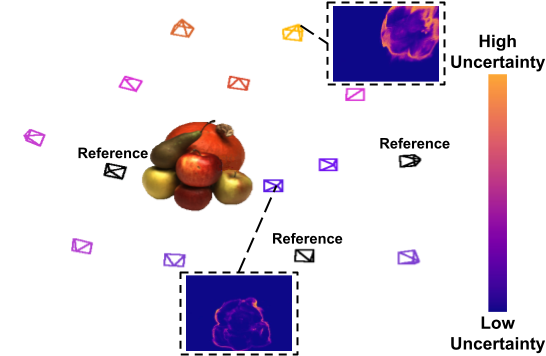
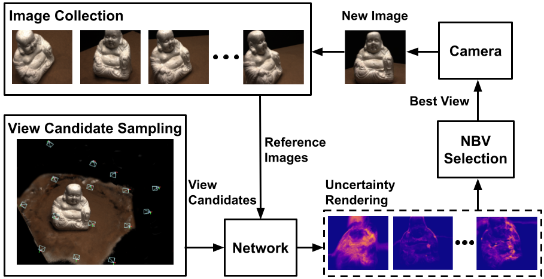

# NeU-NBV: Next Best View Planning Using Uncertainty Estimation in Image-Based Neural Rendering

Liren Jin, Xieyuanli Chen, Julius Rückin, Marija Popovic 
University of Bonn

This repository contains the implementation of our paper "NeU-NBV: Next Best View Planning Using Uncertainty Estimation in Image-Based Neural Rendering" submitted to IROS2023 (under review).

## Abstract

Autonomous robotic tasks require actively perceiving the environment to achieve application-specific goals. In this paper, we address the problem of positioning an RGB camera to collect the most informative images to represent an unknown scene, given a limited measurement budget. We propose a novel mapless planning framework to iteratively plan the next best camera view based on collected image measurements. A key aspect of our approach is a new technique for uncertainty estimation in image-based neural rendering, which guides measurement acquisition at the most uncertain view among view candidates, thus maximising the information value during data collection. By incrementally adding new measurements into our image collection, our approach efficiently explores an unknown scene in a mapless manner. We show that our uncertainty estimation is generalisable and valuable for view planning in unknown scenes. Our planning experiments using synthetic and real-world data verify that our uncertainty-guided approach finds informative images leading to more accurate scene representations when compared against baselines.

An overview of our NBV planning framework:

## Environment Setup
## Dataset
## Network Training
## Network Evaluation
## Planning Experiments
## Acknowledgements
Parts of the code were based on [pixelNeRF](https://github.com/sxyu/pixel-nerf.git) and [NeuralMVS](https://github.com/AIS-Bonn/neural_mvs.git).

## Project Funding
This work has been fully funded by the Deutsche Forschungsgemeinschaft (DFG, German Research Foundation) under Germany’s Excellence Strategy, EXC-2070 – 390732324 (PhenoRob) and supported by the NVIDIA Academic Hardware Grant Program. All authors are with the Institute of Geodesy and Geoinformation, University of Bonn.

